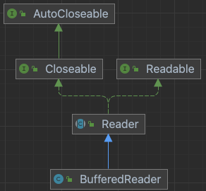

# ITEM 1. 생성자 대신 정적 팩터리 메서드를 고려하라.

## 팩터리 메서드

전통적으로 public 생성자를 사용하여 객체를 생성하는 방법 이외에,  
public static 메서드를 이용하여 해당 클래스의 인스턴스를 얻을 수 있다.

```
public class Book {
    private String name;
    private String author;
    private String publisher;

    public static createBook() {
        return (Book 인스턴스);
    }
}
```

---
### 정적 팩터리 메서드의 장점

#### 1. 이름을 가질 수 있다.
Book 클래스
```
public class Book {
    private String name;
    private String author;
    private String publisher;

    // 생성자를 이용한 객체 초기화
    public Book(String name) {
        this.name = name;
    }

    // 펙토리 메서드를 이용한 객체 초기화
    public static createBookWithName(name) {
        return new Book(name);
    }
}
```

클라이언트 호출 코드
```
Book book1 = new Book("effeciveJava"); 
// "effectiveJava" 가 어떤 인스턴스 변수인지 알기 어렵다.
        
Book book2 = Book.createBookWithName("effectiveJava"); 
// 이름이 "effectiveJava" 임을 한눈에 알 수 있다.
```

#### 2. 하나의 시그니쳐로 여러가지 객체를 생성할 수 있다.
매개변수의 타입과 갯수가 같은 생성자를 여러개 만들 수 없다.
```
public class Book {
    private String name;
    private String author;
    private String publisher;

    public Book(String name) {
        this.name = name;
    }
    
    // 불가능
    public Book(String author) {
        this.author = author;
    }
}
```

하지만 아래와 같이 정적 팩토리 매서드에서는 가능하다.
```
public class Book {
    private String name;
    private String author;
    private String publisher;

    public static Book createBookWithName(String name) {
        Book book = new Book();
        book.name = name;
        return book;
    }

    public static Book createBookWithAuthor(String author) {
        Book book = new Book();
        book.author = author;
        return book;
    }
}
```


#### 3. 호출 할 때마다 인스턴스를 새로 생성하지 않아도 된다.
```
public final class Boolean implements java.io.Serializable, Comparable<Boolean> {
    public static final Boolean TRUE = new Boolean(true);
    public static final Boolean FALSE = new Boolean(false);

    public static Boolean valueOf(boolean b) {
        return (b ? TRUE : FALSE);
    }
    ...
```

정적 팩토리 메서드로 객체 안에 미리 정의된 static final 상수 객체를 반환.  
매번 새로운 객체를 만들지 않는다.

#### 4. 반환 타입의 하위 타입 객체를 반환할 수 있다.
리턴 타입은 인터페이스로 지정하고, 실제로는 인터페이스의 구현체를 리턴함으로서  
구현체의 API 는 노출시키지 않고 객체를 생성할 수 있다.


java.util.Collections 동반 클래스  
-> 자바 8 이전에는 인터페이스 내에 정적 메소드를 가질 수 없었기 때
```
public class Collections {
    // 인스턴스 생성불가
    private Collections() {
    }

    // 정적 펙토리 메서드
    public static <T> List<T> unmodifiableList(List<? extends T> list) {
        return (list instanceof RandomAccess ?
                new UnmodifiableRandomAccessList<>(list) :
                new UnmodifiableList<>(list));
    }

    // 구현체 : non-public 이다.
    static class UnmodifiableList<E> extends UnmodifiableCollection<E> implements List<E> {
        ...
    }
}
```

구현체를 숨기고 public 정적 팩토리 메서드로 제공하므로 API 를 작게 만들 수 있다.
또한 프로그래머가 익혀야 하는 개념과 난이도가 낮아졌다. (개념적 무게가 낮아진다.) 

자바 8 버전 이후로는 인터페이스에서 public static 메소드를 추가할 수 있기 때문에 인터페이스로 만들 수 있다.
private static 메서드는 자바 9 부터 이용할 수 있다.

#### 5. 입력 매개변수에 따라 매번 다른 클래스의 객체를 반환할 수 있다.
위의 예시에서 unmodifialbeList() 의 인수 list 가 RandomAccess 의 인스턴스인지 아닌지에 따라 다른 클래스의 객체를 반환한다.

#### 6. 정적 팩터리 메서드를 작성하는 시점에는 반환할 객체의 클래스가 존재하지 않아도 된다.
서비스 제공자 프레임워크 : 서비스의 구현체를 클라이언트에 제공하는 것을 프레임워크가 통제하여 클라이언트를 구현체로부터 분리

 - 서비스 제공자 프레임워크의 구성요소
   - 서비스 인터페이스 : 구현체의 동작을 정의
   - 서비스 등록 API : 제공자가 구현체를 등록할 때 사용
   - 서비스 접근 API : 클라이언트가 서비스의 인스턴스를 얻을 때 사용
   - 서비스 제공자 인터페이스 : 서비스 인터페이스의 인스턴스를 생성하는 팩터리 객체
   
```
// jdbc 연결하는 코드
Class.forName("oracle.jdbc.driver.OracleDriver"); 
Connection conn = null; 
conn = DriverManager.getConnection("jdbc:oracle:thin:@localhost:1521:ORA92", "scott", "tiger"); 
Statement..
```
위의 코드에서 Connection 이 서비스 인터페이스,  
리플렉션을 이용해 클래스가 로드될 때 드라이버를 등록하는 DriverManager.registerDriver 가 제공자 등록 API,  
서비스 인터페이스인 Connection 에 대한 접근을 제공하는 DriverManager.getConnection 이 서비스 접근 API 역할을 하게 된다.

드라이버가 서비스 제공자 인터페이스 역할을 한다.

**드라이버는 어떤 드라이버가 쓰일지 모른다.**  

oracle, mysql .. 각 DBMS 에 맞는 Driver 가 있고,  
Class.forName() 의 인수를 통해 알맞은 드라이버를 등록하고 필요한 객체를 얻는다.

정적 팩터리 메서드를 작성하는 시점에는 반환할 객체의 클래스가 존재하지 않아도 된다 라는 말의 의미는  
반환할 객체를 펙토리 메서드 방식을 이용하여 만들기 때문에, JDBC 에서도 각 상황에 따라서 펙토리 메서드 내용만 바꿔서  
연결에 필요한 객체를 얻을 수 있다는 말이다.

---
### 정적 팩터리 메서드의 단점
 - 상속을 하려면 public, protected 생성자가 필요하기 때문에, 정적 펙토리 메서드만 제공하면 하위 클래스를 만들 수 없다.
   - java.util.Collections 로 만든 구현체는 상속할 수 없다.
    
 - 정적 팩터리 메서드는 찾기가 어렵다.
   - 생성자와는 달리 Javadoc 문서에서 따로 모아주는 기능이 없다.

---
### 정적 팩터리 메서드 명명규칙
```
 - from : 매개변수 하나로 하나의 인스턴스 만듦  
 - of : 여러 매개변수로 인스턴스 만듦  
 - valueOf : from 과 of의 자세한 버전
 - getInstance, instance : (매개변수를 갖거나 갖지 않거나) 같은 인스턴스임을 보장하지 않는 인스턴스 반환
 - create, newInstance : 매번 새로운 인스턴스를 생성하여 반환
 - getType : 인스턴스를 생성할 때, 해당 클래스가 아닌 다른 클래스에서 생성할 때 사용
 - newType : getType 과 동일
 - Type : getType, newType 의 간략버전
```

# ITEM 2. 생성자에 매개변수가 많다면 빌더를 고려하라.

## 자바의 객체 생성 방법

### 점층적 생성자 패턴 (Telescoping constructor patten)
기존의 자바 개발자들은 클래스용 생성자, 정적 팩토리를 사용하기 위해서
점층적 생성자 패턴을 많이 사용하였다.

하지만, 서비스의 복잡도가 올라갈 수록 
하나의 객체에서 표현해야하는 맴버의 수가 늘어나고 있는 상황에서
기존의 점층적 생성자 패턴 (Telescoping constructor patten)을 사용할 경우에
확장성이 몹시 떨어진다.

```java
public class Book {
    private String name;
    private String author;
    private String publisher;

    public static Book(String name) {
        this(name, null, null);
    }

    public static Book(String name, String author) {
        this(name, author, null);
    }

    public static Book(String name, String author, String publisher) {
        this(name, author, publisher);
    }
    ... // 계속해서 맴버 변수가 추가될 때 마다 생성자를 만들어줘야 한다. 
        // 그럼 맴버변수가 N개이면, nC_1 + nC_2 + ... + nC_n 개를 만들어 줘야..? OMG
}
```
 - 매개 변수(맴버 변수)가 많아지면 클라이언트가 코드를 작성하거나 읽기 어렵다.
 - 예를 들면, 클라이언트가 객체를 생성할 때 매개 변수의 `순서`를 바꿔서 넣는 경우, **우연히** Type도 동일한 경우에 컴파일러는 알아채지 못하고 런타임에 이상한 동작을 할 가능성이 높아진다...
 - 그러면 디버깅하는데 시간도 오래걸리고, 화가 잔뜩 날 듯하다.. (하지만, IDE에서 미리 알려주니,, 괜찮지 않을까 싶다)


### 자바빈즈패턴 (JavaBeans Pattern)
자바빈즈패턴의 경우 매개변수가 없는 생성자로 객체를 만든 후, **Setter**를 이용하여 객체를 완성 시키는 방식이다.

자바빈즈패턴은 위에서의 점층적 생성자 패턴에 비해 인스턴스 생성 방식이 `명료`해졌다.
객체 생성 시에 런타임 시에 발생할 수 있는 의도되지 않은 오류를 조금이나마 줄일 수 있었다.
```java
public class Book {
    private String name;
    private String author;
    private String publisher;

    public Book() {    }

    public void setName(String name) {
        this.name = name
    }

    public static setAuthor(String author) {
        this.author = author
    }

    public static setPublisher(String publisher) {
        this.publisher = publisher
    }
    ... // 계속해서 맴버 변수가 추가될 때 마다 생성자를 만들어줘야 한다.
}
```

하지만, 객체 하나 생성하기 위해서는 *Setter*를 여러 개 호출함으로써 코드가 길어지고 객체가 완성되기 까지 **일관성**이 무너진 상태에 놓이게 된다..

> ## 한 가지 궁금증.  
>> MVC 패턴에서 `DTO`의 개념이 존재하는데,  
`DTO`객체는 중개의 역할 즉, 객체 내부의 맴버 변수들이 계속해서 변할 수 있는 것이 아닌가?  
그럼 그럴때에는 빈즈패턴으로 구성하는 게 맞는 건지 궁금하다..  
그렇다면,,? `VO`는 빈즈로 구성하면 안되는 것인가..? Read-Only고 Getter Method만 가지기 때문에?

이러한 **일관성** 문제를 해결하고자, 프로그래머가 수동으로 *freeze* 시키는 로직을 만들어 얼리기 전까지(완성되기 전까지)는 참조할 수 없도록 구성했다고 한다.  
하지만 이러한 방법도 결국에는 프로그래머가 로직을 개발해서 사용했기 때문에 컴파일러가 보증할 수 없다는 단점이 있었다.
```
Spring Boot에서는 lombok에서 지원하는 @Data Annotation으로 손쉽게 Getter/Setter를 사용할 수 있다.
```

### 빌더 패턴 (Builder Pattern)

자바빈즈의 가독성과 점층적 생성자 패턴의 안정성(일관성)을 동시에 가지고 있는 빌더 패턴이다.  
빌더 패턴은 파이썬과 스칼라에 있는 **명명된 선택적 매개변수 (named optioonal parameters)**를 흉내낸 것!  
빌더 패턴은 계층적으로 설계된 클래스와 함께 쓰기에 좋다.
```java
public class Book {
    private final String name;
    private final String author;
    private final String publisher;

    public static class Builder {
        private final String name;

        private final String author = "HongGilDong";
        private final String publisher = "HanGang";

        public Builder(String name) {   this.name = name    }

        public Buidler author(String author) {  this.author = author; return this   }
        public Buidler publisher(String publisher) {  this.publisher = publisher; return this   }

        public Book build() {   return new Book(this)  }
    }

    private Book(Builder builder) {
        this.name = builder.name;
        this.author = builder.author;
        this.publisher = builder.publisher;
    }
    ... // 추가적인 유효성 검사 코드 작성 가능
}
```
클라이언트 코드는 다음과 같다.
```java
Book book = new Book.Builder("title").author("kyounghwan").publisher("sejong").build()
```
> 무언가 함수형 프로그래밍 같은 느낌이 난다.
```
Spring Boot에서는 lombok에서 지원하는 @Builder Annotation으로 손쉽게 Builder Pattern을 사용할 수 있다.
```

# ITEM 3. private 생성자나 열거 타입으로 싱글턴임을 보증하라.
**싱글턴(singleton)** : 인스턴스를 오직 하나만 생성할 수 있는 클래스. 보통 무상태(stateless) 객체나 설계상 유일해야 하는 시스템 컴포넌트 등에 사용.

## public static final 필드 방식의 싱글턴
- 생성자를 private으로 설정하여 외부에서 인스턴스를 생성할 수 없게 한다.

- public static final 필드로 new 키워드를 통해 인스턴스를 하나만 생성한다.

- 외부에서는 SingletonClass.INSTANCE를 통해 인스턴스에 접근한다.

 
```java
public class Singleton1 {
    // public static 멤버 변수를 통해 싱글턴 인스턴스 생성
    public static final Singleton1 INSTANCE = new Singleton1();

    // 생성자의 접근제어자를 private으로 설정하여 외부에서 인스턴스의 생성을 막음
    private Singleton1() {
    }
}
```
장점

- 코드가 간결하다 

- private static final 필드를 확인함으로써 해당 클래스가 싱글턴임이 쉽게 API에 명백히 드러난다.

## 정적 팩터리 메서드 방식의 싱글턴
- 생성자를 private으로 설정하여 외부에서 인스턴스를 생성할 수 없게 한다.

- private static final 필드로 new 키워드를 통해 인스턴스를 하나만 생성한다.

- 위 인스턴스를 return하는 정적 팩터리 메서드를 생성한다. ex) getInstance()

- 외부에서는 SingletonClass.getInstance()를 통해 인스턴스에 접근한다.

 
 
```java
public class Singleton2 implements Serializable {

    private static final Singleton2 INSTANCE = new Singleton2();

    private Singleton2() {
    }

    // 정적 팩터리 메서드를 통해 같은 instance 반환
    public static Singleton2 getInstance() {
        return INSTANCE;
    }
}
```
장점 

- API를 바꾸지 않고도 (or 외부 코드를 수정하지 않고도) 싱글턴이 아닌 방식으로 변경할 수 있다. (getInstance() 메서드를 수정하여 스레드별 다른 인스턴스 반환 등의 변경 가능)

- 원한다면 정적 팩터리 메서드를 제네릭 싱글턴 팩터리 메서드로 만들 수 있다. (해당 파트는 공부 후 내용 추가)

- 정적 팩터리의 메서드 참조를 공급자(Supplier) 타입으로 사용할 수 있다. (SingletonClass::getInstance 형태처럼)

## 위 두 방식 모두 클래스를 역직렬화 할 때마다 새로운 인스턴스가 생성되는 문제가 발생한다.
- 이를 해결하기 위해서는 모든 인스턴스 필드를 transient(일시적, 직렬화 하지 않겠다)라고 선언한다.

- readResolve 메서드를 제공해 유일하게 생성된 인스턴스를 반환하도록 한다.

 
 
```java
public class Singleton2 implements Serializable {

    // 기본적으로 static 필드는 직렬화되지 않음
    private static final Singleton2 INSTANCE = new Singleton2();

    // 역직렬화 시 싱글턴을 보장
    private Object readResolve() {
        return INSTANCE;
    }

    private Singleton2() {
    }

    // 정적 팩터리 메서드를 통해 같은 instance 반환
    public static Singleton2 getInstance() {
        return INSTANCE;
    }
}
```
## 더 간결하고, 추가 노력 없이 직렬화가 가능하며, 리플렉션 공격에도 안전한 싱글턴 방식은 원소가 하나뿐인 열거(Enum) 타입이다.
- enum 타입에 instance 원소 하나만을 두면 끝!

- 단, enum 타입은 인터페이스 구현은 가능하지만 클래스 상속은 불가하다.
 
```java
public enum Singleton3 {
    INSTANCE;

    public void doSomething() {
        // do something
    }
}
```

> 위 열거 타입은 이상적인 방식이며, Spring을 사용한다면 Spring Bean을 통해 싱글턴 패턴을 사용하는 것이 제일 나을 것 같다.

# ITEM 4. 인스턴스화를 막으려거든 private 생성자를 사용하라.
## 인스턴스화를 막는 이유

정적 필드와 정적 메소드만으로 구성된 클래스를 만드는 경우가 있다. 예를 들어 java.util.Arrays의 배열을 위한 상수를 정적 필드로 가지고 있고, 배열관련 메소드를 정적 메소드로 가지고 있다. 이러한 성격의 클래스는 인스턴스화를 막는게 일반적이다. 인스턴스를 만든다는 것은 객체마다 다른 속성값을 가지고 있을 때 의미가 있다. 정적 필드와 메소드로만 구성된 클래스는 객체를 만드는것이 의미가 없다. 심지어 메모리상 낭비를 가져온다. 따라서 정적인 방식으로 만들어진 클래스는 인스턴스화를 막는것이 옳다.

## Private 생성자
```java
public class Arrays {
    ...
    private Arrays() {}
    ...
}
```
정적 방식으로 만들어진 java.util.Arrays 클래스는 인스턴스화를 막기위해 생성자를 private로 선언하였다. 인스턴스화를 막기위해서 추상클래스로 정의하는 방법도 생각할 수 있겠지만, 그렇게되면 클래스를 상속하면 다시 인스턴스를 만들 수 있게된다.

## 정적 방법 VS 싱글톤

결과적으로 클래스에 하나의 상태만을 가지고 있는 정적 방법과 하나의 인스턴스만을 만들 수 있는 싱글톤은 유사한 면이 있다. 하나의 상태만을 가지고 있다는 공통점 때문에 싱글톤 객체를 정적 방법으로 구현하거나, 정벅 방법으로 만들어진 클래스를 싱글톤으로 바꾸는 것도 가능해 보인다. 하지만 이 둘은 분명한 차이점이 존재한다.

- 로드: 정적 방법으로 만들어진 클래스는 상태값 까지 클래스 로드시점에 메모리에 올라간다. 하지만 싱글톤의 경우 구현 방법에 따라 실제 사용시점에 메모리에 올라가는 lazy 로드가 가능하다.
- 성능: static 메소드가 일반 메소드보다 성능상에 이점이 있다. (https://stackoverflow.com/questions/3805155/are-java-static-calls-more-or-less-expensive-than-non-static-calls)
- OOP, 인터페이스: 싱글톤을 사용하면 인터페이스를 구현 할 수 있고 OOP의 다양한 특성을 활용하여 유연한 코드를 작성할 수 있다.

# ITEM 5. 자원을 직접 명시하지 말고 의존 객체 주입을 사용하라.
> 객체를 생성할 때, 의존하는 객체를 생성자에 주입하여 클래스의 유연성을 제공할 수 있음!!

클래스가 내부적으로 하나 이상의 자원에 의존하고, 그 자원이 클래스 동작에 영향을 준다면 정적 유틸리티 클래스와 싱글턴과 는 사용하지 않는 것이 좋다. 이 자원들을 클래스가 직접 만들게 해서도 안되며, 그 대신 필요한 자원을 생성자에 넘겨주는 것이 바람직하다. 의존 객체 주입을 통해 클래스의 유연성, 재사용성, 테스트 용이성을 개선할 수 있다.

## 기존 정적 유틸리티 클래스를 사용하여 구현

```java
public class SpellChecker {
    private static final Lexicon dictionary = ...;
    
    private SpellChecker() {} // 객체 생성 방지
    
    public static boolean isValid(String word) { ... }
    public static List<String> suggestions(String typo) { ... }
}
```
## 기존 싱글턴 클래스를 사용하여 구현

```java
public class SpellChecker {
    private final Lexion dictionary = ...;
    
    private SpellChecker( ... ) {}
    public static SpellChecker INSTANCE = new SpellChecker( ... );
    
    public boolean isValid(String word) { ... }
    public List<String> suggestion(String typo) { ... }
}
```
위 방법은 `dictionary` 를 하나만 사용한다고 가정하고 있어 확장성이 떨어진다.  
이 경우에는 dictionary 필드의 final을 제거하고 다른 사전을 사용할 수 있도록 Method를 추가할 수 있지만, 어색한 방법이다. => 멀티 쓰레드환경에서는 사용하지 못함.

클래스는 여러 개의 자원 인스턴스를 관리해야 하며, 클라이언트가 필요한 자원을 사용할 수 있어야 한다. 이런 요구사항을 만족하는 간단한 디자인 패턴이 있는데, 바로 객체를 생성할 때 생성자에 필요한 자원을 전달하는 것.

## 의존 객체 주입을 사용
```java
public class SpellChecker {
    private final Lexicon dictionary;

    ** public SpellChecker(Lexicon dictionary) {
        this.dictionary = dictionary;
    } **

    public static boolean isValid(String word) {
        // dictionary를 사용한 로직
    }

    public static List<String> suggestions(String typo) {
        // dictionary를 사용한 로직
    }
}
```

- 클래스가 내부적으로 하나 이상의 자원에 의존하고, 그 자원이 클래스 동작에 영향을 준다면 싱글턴과 정적 유틸리티 클래스는 사용하지 않는 것이 좋다. 이 자원들을 클래스가 직접 만들게 해서도 안된다.
- 대신 필요한 자원을(혹은 그 자원을 만들어주는 팩토리를) 생성자에(혹은 정적 팩토리나 빌더에) 넘겨준다.
- 의존 객체 주입이라 하는 기법은 클래스의 유연성과 재사용성, 테스트 용이성을 좋게 개선준다.

# ITEM 6. 불필요한 객체 생성을 피하라.
> 같은 기능을 수행하는 객체를 매번 생성하는 것보다 하나를 재사용하는 편이 나을 때가 많다.  
특히, **불변 객체는 언제든 재사용** 할 수 있다.

## 객체의 재사용에 대한 극단적인 예 로 String type을 들 수 있다.
```java
// 실행될 때마다 새로운 String 인스턴스가 생성됨
String s = new String("hunseong");

// String Constant Pool 영역에서 해당 리터럴을 찾음
// 리터럴이 존재한다면 재사용, 없다면 해당 영역에 리터럴 추가
String s = "hunseong";
```
## 정적 팩터리 메서드를 제공하는 불변 클래스에서는 정적 팩터리 메서드를 사용해 불필요한 객체 생성을 피할 수 있다.

```java
// 생성자 - 매번 새로운 인스턴스 생성
// 자바 9에서 Deprecated 지정됨
Boolean(String);

// 정적 팩터리 메서드 - 객체를 재사용
Boolean.valueOf(String);
```

## 인스턴스 생성 비용이 비싼 객체의 경우 캐싱하여 재사용하길 권한다.
 - (불변의) 정규식을 표현하는 Pattern 인스턴스를 static 필드로 생성해 캐싱한다.
 - 생성한 Pattern 인스턴스를 isRomanNumeral 메서드가 호출될 때마다 재사용한다.
 - Pattern 인스턴스는 정규표현식에 해당하는 [FSM(Finite State Machine)](https://ozt88.tistory.com/8)을 만드므로 인스턴스 생성비용이 높다.

## 불필요한 객체를 생성할 수 있는 오토박싱(Auto boxing)에 주의하라.

- 오토박싱(auto boxing) : 기본 타입, 박싱된 기본 타입을 섞어 쓸 때 자동으로 상호 변환해주는 기술

- 아래 메서드와 같이 long을 Long으로 선언함으로써 오토박싱이 동작하여 불필요한 Long 인스턴스가 여러 개 생성된다.

   -> long i 가 Long 타입으로 오토박싱됨

- 이는 성능저하의 엄청난 원인이 된다.

- 박싱된 기본 타입보다는 기본 타입을 사용하고, 의도치 않은 오토박싱을 주의하자.
``` java
private static long sum() {
    // long이 아닌 Long 타입으로 선언하여 오토박싱에 의해 새로운 Long 인스턴스가 계속 생성된다.
    Long sum = 0L;
    for (long i = 0; i <= MAX_VALUE; i++) {
        sum += i;
    }
    return sum;
}
```

# ITEM 7. 다 쓴 객체 참조를 해제하라.
자바는 JVM에서 가비지 컬렉터가 불필요한 메모리를 알아서 정리해주지만 스택, 캐시, 리스너 또는 콜백과 관련한 자기 메모리를 직접 관리하는 클래스라면 메모리 누수에 주의해야한다. 
```java
public class Stack {
    private Object[] elements;
    private int size = 0;
    private static final int DEFAULT_INITIAL_CAPACITY = 16;

    public Stack() {
        elements = new Object[DEFAULT_INITIAL_CAPACITY];
    }

    public void push(Object e) {
        ensureCapacity();
        elements[size++] = e;
    }

    public Object pop() {
        if (size == 0)
            throw new EmptyStackException();
        return elements[--size];
    }

    /**
     * 원소를 위한 공간을 적어도 하나 이상 확보한다.
     * 배열 크기를 늘려야 할 때마다 대략 두 배씩 늘린다.
     */
    private void ensureCapacity() {
        if (elements.length == size)
            elements = Arrays.copyOf(elements, 2 * size + 1);
    }
}
```
Stack Class의 pop Method의 경우에 원래 Stack에 들어가 있던 Value를 없앰으로써, 더 이상 사용하지 않는 메모리가 생길 수 있다. GC가 자동으로 이런 메모리를 잡아 Clear 해줄거라고? 생각하지만 실제로는 그렇지 않다. 

왜냐하면 Stack Class가 통째로 Clear 되지 않는 이상 참조를 계속하고 있기 때문에 GC는 잘 알지 못하여 계속해서 메모리 누수가 발생할 수 있다.

```java
    public Object pop() {
        if (size == 0)
            throw new EmptyStackException();
        Object result = elements[--size];
        elements[size] = null; // 다 쓴 참조 해제
        return result;
    }
```
위와 같이 `null`로 명시적으로 선언해줌으로써 GC에서 잡아가도록 해야 좋다.

> 경험담. 실제로 OOM의 발생 원인 중에 메모리 누수를 겪어봤다.. 저런 Stack에 데이터가 큰 것들이 쌓이게 되고 다 쓴 후에 메모리 Release가 안되면 큰일이 날 수 있다.

# ITEM 8. finalizer와 cleaner 사용을 피하라.
자바는 두가지 객체 소멸자를 제공한다. finalizer과 cleaner이다.

finalizer와 cleaner는 GC될때 호출된다.

finalizer는 예측할 수 없고, 상황에 따라 위험할 수 있어 일반적으로 불필요하다. (자바9에서는 finalizer을 deprecated 시켰고 그 대안으로 cleaner을 제시했다.)

cleaner는 finalizer보다는 덜 위험하지만, 여전히 예측할 수 없고, 느리고, 일반적으로 불필요하다.

## finalizer와 cleaner는 즉시 수행된다는 보장이 없다.
객체에 접근을 할 수 없게 된 후 finalizer나 cleaner가 실행되기까지 얼머나 걸리는지 알수 없다.

** 즉, finalizer와 cleaner로는 제때 실행되어야 하는 작업은 절대 할 수 없다. **

예컨대, 파일 닫기를 finalizer나 cleaner에게 맡기면 중대한 finalizer가 cleaner가 파일 닫기를 게을리해서 새로운 파일을 열지 못해 문제가 발생할 수 있다.

## finalizer는 인스턴스의 자원 회수가 제멋대로 지연될 수 있다.
finalizer쓰레드는 다른 애플리케이션 쓰레드보다 **우선순위가 낮아서** 제대로 실행될 기회를 얻지 못한다.

이는 곧 OOM을 발생시키는 원인이 될 수도 있다.

cleaner은 자신을 수행할 쓰레드를 제어할 수 있다는 점이 조금 나을순 있으나, 여전히 백그라운드에서 수행되며 GC의 통제하에 있으니 즉각수행되리라 보장은 없다.

## finalizer와 cleaner는 수행 시점뿐 아니라 수행 여부조차 보장하지 않는다.

상태를 영구적으로 수정하는 작업에서는 절대 finalizer나 cleaner에 의존해서는 안된다.

예를 들어, DB같은 공유 자원의 영구 락 해제를 finalizer나 cleaner에 맡겨 놓으면 분산시스템 전체가 서서히 멈출 것이다.

## finalizer 동작 중 발생한 예외는 무시되며, 처리할 작업이 남았더라도 그 순간 종료된다.
잡지 못한 예외 때문에 해당 객체는 자칫 마무리가 덜 된 상태로 남을 수 있다.

그리고 다른 쓰레드가 이 훼손된 객체를 사용하려 한다면 무슨 일이 일어날지 알 수 없다.

보통의 경우에는 잡지 못한 예외가 스레드를 중단하고 스택 추적 내역을 출력하겠지만, 같은 일이 finalizer에서 일어난다면 경고조차 출력하지 않는다.

그나마 cleaner를 사용하는 라이브러리는 자신의 쓰레드를 통제하기 때문에 이러한 문제가 발생하지 않는다.

## finalizer와 cleaner는 심각한 성능 문제도 동반한다.
AutoCloseable 객체를 생성하고 GC가 수거하기까지 12ns가 걸린 반면(try-with-resources로 자신을 닫도록 했다), finalizer를 사용하면 550ns가 걸렸다.

그 이유는 finalizer가 GC의 효율을 떨어뜨리기 때문이다.

## finalizer를 사용한 클래스는 finalizer 공격에 노출되어 심각한 보안 문제를 일으킬 수도 있다.
finalizer의 공격 원리는 A라는 클래스가 있을 때, 이것을 상속받은 B라는 클래스가 악의적으로 예외를 던지고 finalize()를 overriding하게 되면 죽을 때 finalize가 실행되는데 이때, 인스턴스의 static field나 메소드에 접근할 수 있다. 그래서 **죽어야하는 인스턴스인데 좀비처럼 살아 있게 된다.**

## 자원 반납 방법
### AutoCloseable을 구현해주고, 클라이언트에서 인스턴스를 다 쓰고 나면 close 메소드를 호출한다.
일반적으로 예외가 발생해도 제대로 종료되도록 try-with-resources 를 사용해야 한다 (아이템9)

close 메소드에서 이 객체는 더 이상 유효하지 않음을 필드에 기록하고, 다른 메소드는 이 필드를 검사해서 객체가 닫힌 후 에 불렸다면 IllegalStateException을 던지는것이다 .
```java
public class SampleClass implements AutoCloseable{
    private boolean isClosed;

    @Override
    public void close() throws RuntimeException {
    if(this.isClosed) {
        throw new IllegalStateException;
    }
    isClosed = true;
    }

    /**
    *  다른 메소드 생략
    */
    }

public Main() {

    public static void main(String[] args) {
    SampleClass sampleClass = new SampleClass();
     sampleClass.close();
    }
}
```

# ITEM 9. try-finally보다는 try-with-resources를 사용하라.

## try-finally의 단점

InputStream, OutputStream과 java.sql.Connection과 같은 자원은 close 메서드를 사용자가 직접 호출해 닫아주어야 한다.

이런 자원을 직접 닫아주지 않아도 gc가 알아서 처리해주긴 하지만 그 시점을 정확히 알 수 없기 때문에 직접 닫아주는 것이 가장 안전하다.

Java7 이전에는 자원의 닫힘을 처리하기 위해 try-finally가 사용되었다.

BufferedReader를 사용해 한 줄의 콘솔 입력을 받는 메서드는 아래와 같다.

```java
String readLine() throws IOException {
    BufferedReader br = new BufferedReader(new InputStreamReader(System.in));
    try {
    	return br.readLine();
    } finally {
    	br.close();
    }
}
```
단순히 하나의 자원을 가져오고 닫아주는 과정은 그렇게 복잡하지 않지만 동시에 여러 자원을 사용하는 경우 코드가 매우 복잡해진다.
```java
...
InputStream in = new FileInputStream(...);
try {
    OutputStream out = new FileOutputStream(...);
    try {
        ...
    } finally {
        out.close();
} finally {
    in.close();
} ... 마치 Flattening Arrow Code.. 같다..
``` 
동시 사용 자원이 늘어날수록 try-finally가 중첩되어 가독성이 상당히 떨어지고 실수할 위험도 매우 증가한다.

다른 문제로 통신을 통한 외부 자원을 사용하는 상황을 가정할 때, 외부의 문제로 try 블록에서의 자원 사용에서 예외가 발생하고 동시에 finally 블록에서의 close 메서드 또한 예외가 발생할 수 있다. 이런 경우 스택 트레이스에선 이후에 실행된 finally 블록의 예외만이 나타나게 되어 디버깅이 어려워질 수 있다.

## try-with-resources
자바 7 이후의 try-with-resources는 이런 자원 관리를 매우 간편하게 수행해 준다.

try-with-resources로 BufferedReader를 아래와 같이 사용할 수 있다.
```java
String readLine() throws IOException {
    try (BufferedReader br = new BufferedReader(new InputStreamReader(System.in))) {
        return br.readLine();
    }
    // 필요하다면 catch 블록 또한 추가할 수 있다.
}
```
try-with-resources를 사용하려면 반납해야 할 자원을 try 구문의 괄호 안에 정의하면 되며 try 블록이 수행된 이후 알아서 자원을 닫아준다. 이런 식으로 try 블록에 소괄호로 선언되는 자원은 인터페이스인 AutoCloseable의 구현체여야 한다. 빈번하게 사용되는 BufferedReader나 Input/OutputStream, java.sql.Connection 등은 이미 이 인터페이스를 상속하고 있으며 AutoCloseable은 close 메서드 하나만 정의하면 되는 간단한 인터페이스다.



try-finally와 달리 finally 블록이 없어 가독성 면에서도 깔끔하고 자동으로 자원의 반환이 일어나므로 실수할 여지가 줄어든다. 여러 자원을 사용하더라도 try-finally와 같이 중첩할 필요 없이 여러 자원을 괄호 안에 한 번에 선언하면 **사용 이후 위에서부터 순차적으로 해제해 준다.**

또한 위에서 언급한 finally 문에서의 예외 발생 시 try 블록의 예외가 묻히는 문제 또한 해결되었다. 별도의 설정이 없다면 프로그래머에게 주된 관심 사항인 자원의 활용 부분 (br.readLine()) 에서 발생한 예외를 주요하게 보여주고, close 메서드와 같이 자원 회수 시 발생하는 예외는 **suppressed라는 표시를 달고 스택 트레이스 내역에 함께 표시**된다.

> 꼭 회수해야 하는 자원을 다룰 떄는 try-with-resources 를 사용하자.  
코드는 더 짧고 분명해지고 , 만들어지는 예외정보도 훨씬 유용하다.